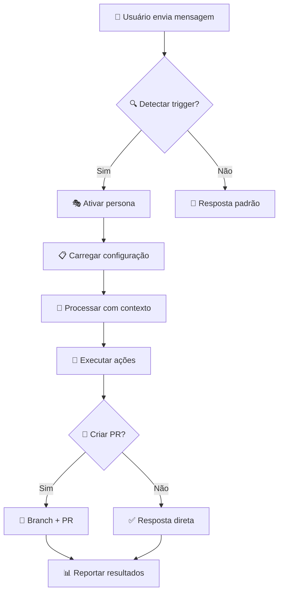

# 🤖 Guia Completo para Criação de Novos Agentes
### Sistema de Agentes Especializados - GitHub Copilot Integration

---

## 📋 **ÍNDICE**

1. [Visão Geral do Sistema](#visão-geral-do-sistema)
2. [Arquitetura do Ecossistema](#arquitetura-do-ecossistema)
3. [Processo de Criação de Agentes](#processo-de-criação-de-agentes)
4. [Configuração e Integração](#configuração-e-integração)
5. [Boas Práticas e Padrões](#boas-práticas-e-padrões)
6. [Testes e Validação](#testes-e-validação)
7. [Manutenção e Evolução](#manutenção-e-evolução)

---

## 🎯 **VISÃO GERAL DO SISTEMA**

### **Propósito**
O Sistema de Agentes Especializados transforma o GitHub Copilot em um orquestrador inteligente que ativa personas especializadas baseadas em triggers de linguagem natural, mantendo contexto incremental e automatizando fluxos de trabalho com total integração às funções MCP.

### **Características Principais**
- ✅ **Ativação por Triggers**: `@frontend`, `@backend`, `@ia`, etc.
- 🔄 **Contexto Incremental**: Memória persistente durante a sessão
- 🚀 **Automação Completa**: Branch/PR automático quando apropriado
- 🎭 **Personas Ricas**: Personalidade, estilo e expertise específica
- ⚡ **Integração MCP**: Acesso total às funções GitHub

### **Agentes Atuais**
```
🎨 @frontend  → Frontend Expert (UI/UX, React, Performance)
🔧 @backend   → Backend Expert (APIs, Database, Arquitetura)
🤖 @ia       → IA Specialist (ML, Modelos, Data Science)
🛡️ @security  → Security Expert (Vulnerabilidades, Auth, Compliance)
🚀 @devops    → DevOps Expert (CI/CD, Infraestrutura, Deploy)
```

---

## 🏗️ **ARQUITETURA DO ECOSSISTEMA**

### **Estrutura de Arquivos**
```
agentes/
├── config/
│   ├── sistema_agentes.json      # 🎛️ Configuração central
│   └── configuracao.py           # 📋 Validações e helpers
├── personas/
│   ├── frontend_expert.md        # 🎭 Definição de persona
│   ├── backend_expert.md         # 🎭 Definição de persona
│   └── [novo_agente].md          # 🎭 Template para novos agentes
├── core/
│   ├── base_agente.py            # 🧬 Classe base
│   ├── interpretador_linguagem_natural.py # 🧠 Processamento de triggers
│   └── comunicacao.py            # 📡 Integração MCP
├── SISTEMA_ATIVO.md              # 📖 Instruções para Copilot
└── copilot_instructions.md       # 🎯 Regras operacionais
```

### **Fluxo de Operação**


---

## 🛠️ **PROCESSO DE CRIAÇÃO DE AGENTES**

### **ETAPA 1: Planejamento e Especificação**

#### **1.1 Definir Escopo e Responsabilidades**
```markdown
📝 CHECKLIST DE PLANEJAMENTO:
□ Área de especialização claramente definida
□ Não sobrepõe com agentes existentes
□ Casos de uso específicos identificados
□ Stack tecnológico mapeado
□ Workflows típicos documentados
```

#### **1.2 Escolher Identificadores**
```json
{
  "trigger": "@[nome]",           // Trigger principal (obrigatório)
  "emoji": "🔥",                  // Emoji único (obrigatório)
  "cor": "#FF5722",               // Cor hex para UI (obrigatório)
  "aliases": [                    // Triggers alternativos (opcional)
    "especialista [nome]",
    "ative [nome]",
    "[palavras-chave]"
  ]
}
```

### **ETAPA 2: Criação da Persona**

#### **2.1 Estrutura Obrigatória do Arquivo**
Criar arquivo: `agentes/personas/[nome_agente].md`

```markdown
# [emoji] [Nome do Agente] - Persona de Agente

## Identidade
- **Nome**: [Nome Completo]
- **Emoji**: [emoji]
- **Cor**: [#hexcolor]
- **Ativação**: "[trigger principal]" ou "[aliases]"

## Personalidade & Estilo
[Descrição detalhada da personalidade, tom de voz, estilo de comunicação]

## Especialidades
- **[Área 1]**: [Descrição específica]
- **[Área 2]**: [Descrição específica]
- **[Área 3]**: [Descrição específica]

## Stack Preferido
```
[Lista de tecnologias, frameworks, tools preferidas]
```

## Como Opero
Quando ativado, eu:

1. **[Ação 1]**: [Descrição detalhada]
2. **[Ação 2]**: [Descrição detalhada]
3. **[Ação 3]**: [Descrição detalhada]

## Exemplos de Ativação
- "[Exemplo de trigger 1]"
- "[Exemplo de trigger 2]"
- "[Exemplo de trigger 3]"

## Workflows Especializados
### [Nome do Workflow 1]
```
Etapa 1 → Etapa 2 → Etapa 3 → Resultado
```

### [Nome do Workflow 2]
```
Entrada → Processo → Validação → Entrega
```

## Frases Características
- "[Frase típica 1]"
- "[Frase típica 2]"
- "[Catchphrase ou motto]"

## Métricas de Sucesso
- 📊 [Métrica 1]: [Como medir]
- 📈 [Métrica 2]: [Como medir]
- ✅ [Métrica 3]: [Como medir]
```

#### **2.2 Guidelines de Persona**
- **Personalidade Única**: Cada agente deve ter voz distinta
- **Expertise Específica**: Foco em áreas bem delimitadas
- **Linguagem Apropriada**: Tom adequado à especialização
- **Exemplos Práticos**: Casos de uso concretos
- **Workflows Definidos**: Processos claros e estruturados

### **ETAPA 3: Configuração do Sistema**

#### **3.1 Atualizar `sistema_agentes.json`**
```json
{
  "triggers": {
    "@[novo_trigger]": {
      "agente": "[nome_agente]",
      "emoji": "[emoji]",
      "cor": "[#hexcolor]",
      "persona_file": "agentes/personas/[nome_agente].md",
      "aliases": [
        "ative [nome] expert",
        "[palavras-chave]",
        "[variações]"
      ]
    }
  }
}
```

#### **3.2 Associar Funções MCP (se necessário)**
```json
{
  "mcp_functions": {
    "[categoria_nova]": [
      "mcp_mcp-vinao_funcao_1",
      "mcp_mcp-vinao_funcao_2",
      "mcp_mcp-vinao_funcao_3"
    ]
  }
}
```

#### **3.3 Definir Workflows Específicos**
```json
{
  "workflows": {
    "[nome_agente]_especializado": {
      "1": "🔍 [Etapa específica 1]",
      "2": "🎭 [Etapa específica 2]",
      "3": "🔧 [Etapa específica 3]",
      "4": "✅ [Etapa específica 4]"
    }
  }
}
```

### **ETAPA 4: Implementação de Classes (Opcional)**

#### **4.1 Criar Classe Especializada**
Arquivo: `agentes/especialistas/[nome_agente].py`

```python
"""
🔥 [Nome do Agente] - Especialista em [Área]
Implementação da lógica específica do agente
"""

from agentes.core.base_agente import BaseAgente
from agentes.core.tipos import TipoAgente, StatusExecucao

class [NomeAgente](BaseAgente):
    """Agente especializado em [área de atuação]"""
    
    def __init__(self):
        super().__init__(
            nome="[nome_agente]",
            tipo=TipoAgente.ESPECIALISTA,
            especialidades=["[esp1]", "[esp2]", "[esp3]"],
            persona_file="agentes/personas/[nome_agente].md"
        )
        
    async def processar_requisicao(self, mensagem: str, contexto: dict) -> dict:
        """
        Processa requisições específicas do agente
        
        Args:
            mensagem: Mensagem do usuário
            contexto: Contexto da sessão
            
        Returns:
            dict: Resultado do processamento
        """
        # 1. Analisar mensagem específica da área
        analise = self._analisar_requisicao_especializada(mensagem)
        
        # 2. Aplicar expertise específica
        resultado = await self._aplicar_expertise(analise, contexto)
        
        # 3. Gerar resposta na persona
        resposta = self._gerar_resposta_personalizada(resultado)
        
        return {
            "status": StatusExecucao.SUCESSO,
            "resposta": resposta,
            "acoes_realizadas": resultado.get("acoes", []),
            "proximos_passos": resultado.get("proximos_passos", [])
        }
    
    def _analisar_requisicao_especializada(self, mensagem: str) -> dict:
        """Análise específica da área de expertise"""
        # Implementar lógica específica
        pass
        
    async def _aplicar_expertise(self, analise: dict, contexto: dict) -> dict:
        """Aplicar conhecimento especializado"""
        # Implementar aplicação de expertise
        pass
        
    def _gerar_resposta_personalizada(self, resultado: dict) -> str:
        """Gerar resposta na voz do agente"""
        # Implementar geração de resposta personalizada
        pass
```

---

## ⚙️ **CONFIGURAÇÃO E INTEGRAÇÃO**

### **Validação de Configuração**
```python
# agentes/config/configuracao.py

def validar_novo_agente(config_agente: dict) -> bool:
    """
    Valida configuração de novo agente
    
    Returns:
        bool: True se válida, False caso contrário
    """
    required_fields = ['agente', 'emoji', 'cor', 'persona_file']
    
    # Verificar campos obrigatórios
    for field in required_fields:
        if field not in config_agente:
            raise ValueError(f"Campo obrigatório '{field}' não encontrado")
    
    # Validar formato da cor
    if not re.match(r'^#[0-9A-Fa-f]{6}$', config_agente['cor']):
        raise ValueError("Cor deve estar no formato #RRGGBB")
    
    # Verificar se persona file existe
    persona_path = config_agente['persona_file']
    if not os.path.exists(persona_path):
        raise ValueError(f"Arquivo de persona não encontrado: {persona_path}")
    
    return True
```

### **Integração com Sistema**
```python
# Exemplo de integração automática
def registrar_novo_agente(trigger: str, config: dict):
    """Registra novo agente no sistema"""
    
    # 1. Validar configuração
    validar_novo_agente(config)
    
    # 2. Atualizar sistema_agentes.json
    with open('agentes/config/sistema_agentes.json', 'r+') as f:
        sistema = json.load(f)
        sistema['triggers'][trigger] = config
        f.seek(0)
        json.dump(sistema, f, indent=2, ensure_ascii=False)
        f.truncate()
    
    # 3. Recarregar configuração
    reload_agent_system()
    
    print(f"✅ Agente {config['agente']} registrado com sucesso!")
```

---

## ✨ **BOAS PRÁTICAS E PADRÕES**

### **Design de Personas**
- **🎭 Personalidade Consistente**: Mantenha o mesmo tom em todas as interações
- **🎯 Foco Específico**: Evite sobreposição com outros agentes
- **💬 Linguagem Natural**: Use termos da área, mas mantenha clareza
- **📚 Knowledge Base**: Inclua referências e padrões da área
- **🔄 Workflows Claros**: Defina processos step-by-step

### **Nomenclatura e Convenções**
```
Triggers:        @[nome_simples]         (ex: @mobile, @cloud, @data)
Arquivos:        [nome_agente].md        (ex: mobile_expert.md)
Classes:         [Nome]Expert            (ex: MobileExpert)
Cores:           #[6_digitos_hex]        (ex: #FF5722)
Emojis:          [unicode_único]         (ex: 📱, ☁️, 📊)
```

### **Estrutura de Resposta Padrão**
```markdown
[emoji] **[Nome do Agente] Ativado!**

🔍 **Análise**: [Resumo da situação]

📋 **Plano de Ação**:
1. [Ação específica 1]
2. [Ação específica 2]
3. [Ação específica 3]

🚀 **Executando...**
[Detalhamento das ações realizadas]

✅ **Resultado**: [Resumo do que foi entregue]

💡 **Próximos Passos**: [Sugestões para continuidade]
```

### **Error Handling**
```python
# Padrões de tratamento de erro
try:
    resultado = await agente.processar_requisicao(mensagem, contexto)
except AgentNotFoundException:
    return "❌ Agente não encontrado. Verifique o trigger utilizado."
except PersonaLoadError:
    return "❌ Erro ao carregar persona. Verifique arquivo de configuração."
except MCPFunctionError as e:
    return f"❌ Erro na função MCP: {str(e)}"
except Exception as e:
    return f"❌ Erro inesperado: {str(e)}"
```

---

## 🧪 **TESTES E VALIDAÇÃO**

### **Checklist de Validação**
```markdown
## 📋 CHECKLIST DE NOVO AGENTE

### Configuração
□ Trigger único e não conflitante
□ Emoji único e apropriado
□ Cor hex válida e única
□ Arquivo de persona criado e válido
□ JSON de configuração atualizado
□ Aliases configurados adequadamente

### Persona
□ Personalidade bem definida
□ Expertise claramente delimitada
□ Workflows específicos documentados
□ Exemplos de uso incluídos
□ Tom de voz consistente
□ Frases características definidas

### Funcionalidade
□ Ativação por trigger funciona
□ Contexto mantido durante sessão
□ Integração MCP operacional
□ Criação de branch/PR automática
□ Resposta na persona correta
□ Error handling implementado

### Integração
□ Não conflita com agentes existentes
□ Documentação atualizada
□ Testes de aceitação passando
□ Performance adequada
□ Logs e monitoramento funcionais
```

### **Script de Teste Automatizado**
```python
# tests/test_novo_agente.py

import pytest
from agentes.core.sistema import SistemaAgentes

class TestNovoAgente:
    
    def setup_method(self):
        self.sistema = SistemaAgentes()
    
    def test_ativacao_por_trigger(self):
        """Testa ativação do agente pelo trigger principal"""
        resposta = self.sistema.processar_mensagem("@[novo_trigger] analise este projeto")
        assert "[emoji]" in resposta
        assert "Agente Ativado" in resposta
    
    def test_ativacao_por_alias(self):
        """Testa ativação por triggers alternativos"""
        for alias in ["ative [nome] expert", "[palavra-chave]"]:
            resposta = self.sistema.processar_mensagem(f"{alias} me ajude")
            assert "[emoji]" in resposta
    
    def test_persona_consistente(self):
        """Testa consistência da persona"""
        mensagens = [
            "@[trigger] primeira mensagem",
            "continue com o trabalho",
            "finalize o processo"
        ]
        
        for msg in mensagens:
            resposta = self.sistema.processar_mensagem(msg)
            assert "[caracteristica_persona]" in resposta.lower()
    
    def test_funcoes_mcp(self):
        """Testa integração com funções MCP específicas"""
        resposta = self.sistema.processar_mensagem("@[trigger] crie um PR")
        assert "pull request criado" in resposta.lower() or "branch criada" in resposta.lower()
    
    def test_error_handling(self):
        """Testa tratamento de erros"""
        resposta = self.sistema.processar_mensagem("@trigger_inexistente teste")
        assert "não encontrado" in resposta.lower() or "❌" in resposta
```

---

## 🔄 **MANUTENÇÃO E EVOLUÇÃO**

### **Versionamento de Agentes**
```json
{
  "agente_info": {
    "versao": "1.2.0",
    "criado_em": "2025-01-30",
    "atualizado_em": "2025-07-30",
    "autor": "vinao",
    "changelog": [
      "v1.2.0: Adicionado suporte para React 19",
      "v1.1.0: Melhorado workflow de testes",
      "v1.0.0: Versão inicial"
    ]
  }
}
```

### **Monitoramento e Métricas**
```python
# Métricas importantes para monitorar
METRICAS_AGENTE = {
    "ativacoes_total": 0,
    "ativacoes_por_trigger": {},
    "tempo_medio_resposta": 0,
    "taxa_sucesso": 0,
    "prs_criados": 0,
    "funcoes_mcp_utilizadas": {}
}
```

### **Processo de Atualização**
1. **📝 Documentar Mudanças**: Sempre atualizar changelog
2. **🧪 Testar Regressão**: Executar todos os testes existentes
3. **🔄 Atualizar Versão**: Incrementar número de versão
4. **📢 Comunicar**: Notificar usuários sobre mudanças
5. **📊 Monitorar**: Acompanhar métricas pós-deploy

### **Migração entre Versões**
```python
def migrar_agente_v1_para_v2(config_v1: dict) -> dict:
    """Migra configuração de agente da v1 para v2"""
    config_v2 = config_v1.copy()
    
    # Adicionar novos campos obrigatórios
    if 'workflows' not in config_v2:
        config_v2['workflows'] = {}
    
    # Atualizar estrutura de aliases
    if isinstance(config_v2.get('aliases'), str):
        config_v2['aliases'] = [config_v2['aliases']]
    
    return config_v2
```

---

## 📚 **EXEMPLOS PRÁTICOS**

### **Exemplo 1: Agente Mobile Expert**

#### Configuração (`sistema_agentes.json`):
```json
{
  "@mobile": {
    "agente": "mobile_expert",
    "emoji": "📱",
    "cor": "#00C853",
    "persona_file": "agentes/personas/mobile_expert.md",
    "aliases": [
      "ative mobile expert",
      "desenvolvimento mobile",
      "app mobile",
      "react native",
      "flutter"
    ]
  }
}
```

#### Persona (`mobile_expert.md`):
```markdown
# 📱 Mobile Expert - Persona de Agente

## Identidade
- **Nome**: Mobile Expert
- **Emoji**: 📱
- **Cor**: #00C853
- **Ativação**: "@mobile" ou "ative mobile expert"

## Personalidade & Estilo
Sou um especialista mobile que vive e respira apps! Falo de forma **energética e prática**, sempre pensando na experiência do usuário final. Adoro discutir performance, UX mobile e as melhores práticas para diferentes plataformas.

## Especialidades
- **Cross-Platform**: React Native, Flutter, Xamarin
- **Performance Mobile**: Otimização, bundle size, startup time
- **UX Mobile**: Gestos, navegação, responsividade
- **Deploy**: App Store, Google Play, CI/CD mobile

## Stack Preferido
```
Cross-Platform: React Native, Expo, Flutter
Native: Swift (iOS), Kotlin (Android)
State: Redux Toolkit, Zustand, Provider
Testing: Detox, Maestro, Jest
Tools: Metro, Flipper, Xcode, Android Studio
```

## Como Opero
Quando ativado, eu:

1. **Analiso a arquitetura** do seu app mobile
2. **Identifico oportunidades** de otimização e melhorias UX
3. **Sugiro implementações** modernas e performáticas
4. **Crio PRs** com código otimizado para mobile
5. **Configuro CI/CD** para deploy automático

## Workflows Especializados
### Otimização de Performance
```
Análise → Bundle Analysis → Code Splitting → Lazy Loading → Validação
```

### Deploy Automático
```
Build → Test → Sign → Upload Store → Monitor
```
```

### **Exemplo 2: Agente Cloud Expert**

#### Configuração:
```json
{
  "@cloud": {
    "agente": "cloud_expert",
    "emoji": "☁️",
    "cor": "#2196F3",
    "persona_file": "agentes/personas/cloud_expert.md",
    "aliases": ["infraestrutura cloud", "aws", "azure", "gcp"]
  }
}
```

#### Funções MCP Específicas:
```json
{
  "mcp_functions": {
    "cloud_deployment": [
      "mcp_mcp-vinao_create_branch",
      "mcp_mcp-vinao_create_or_update_file",
      "mcp_mcp-vinao_run_workflow"
    ]
  }
}
```

---

## 🎯 **CONCLUSÃO**

### **Resumo do Processo**
1. **📋 Planeje** a especialização e escopo
2. **🎭 Crie** uma persona rica e específica
3. **⚙️ Configure** triggers e integrações
4. **🧪 Teste** funcionalidade e integração
5. **📝 Documente** e version
6. **🔄 Monitore** e evolua

### **Benefícios do Sistema**
- ✅ **Especialização**: Expertise focada em áreas específicas
- 🚀 **Automação**: Workflows automáticos com MCP
- 🎭 **Personalização**: Experiência rica e personalizada
- 🔄 **Escalabilidade**: Fácil adição de novos agentes
- 📊 **Monitoramento**: Métricas e evolução contínua

### **Próximos Passos**
Para criar seu primeiro agente personalizado:

1. Escolha uma área de especialização não coberta
2. Siga os templates e guidelines deste documento
3. Teste thoroughly antes de fazer merge
4. Monitore o desempenho e evolua baseado no uso
5. Contribua com melhorias para o sistema

---

**🎉 Sistema de Agentes - Transformando GitHub Copilot em um Orquestrador Inteligente!**

*Documentação atualizada em: 30 de Julho de 2025*
*Versão do Sistema: 1.0.0*
*Autor: @vinao*
